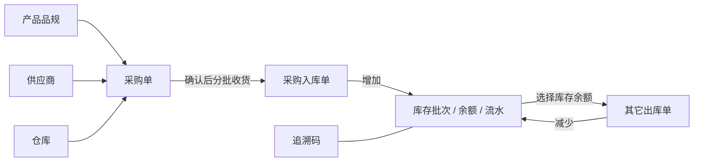

# ERP 业务手册

本手册记录 Hive 当前 ERP 模块的业务边界、运行规则和代码入口，供产品、开发、测试和 AI 共同使用。它描述当前工作区已经实现并由后端约束的行为，不作为未来规划清单。

## 阅读顺序

1. 先读 [ERP 领域词汇](./CONTEXT.md)。
2. 再读当前任务对应的模块文档。
3. 涉及接口时核对 Router、Controller、Model/DTO、Service 和 Swagger。
4. 涉及单据、库存、流水、追溯码或导出时阅读 [系统数据权限规则](../system/data-permission.md)。
5. 涉及页面时继续阅读前端 `hive/business-docs/erp` 下对应的 UI 文档。
6. 文档与代码不一致时，以“待确认差异”方式列出，不静默决定哪一方正确。

## 模块地图

| 模块 | 职责 | 文档 |
|---|---|---|
| 仓库 | 维护仓库、库区、货位基础资料 | [warehouse.md](./warehouse.md) |
| 采购单 | 记录采购约定、状态和操作日志 | [purchase-order.md](./purchase-order.md) |
| 采购入库 | 记录实际收货并增加库存 | [purchase-inbound.md](./purchase-inbound.md) |
| 库存 | 维护批次、余额、流水、追溯码和期初库存 | [inventory.md](./inventory.md) |
| 其它出库 | 记录非销售原因的库存减少 | [other-outbound.md](./other-outbound.md) |

## 规则编号

稳定规则使用 `ERP-模块-序号` 编号：

- `ERP-WH-*`：仓库、库区、货位。
- `ERP-PO-*`：采购单。
- `ERP-PI-*`：采购入库。
- `ERP-INV-*`：库存与追溯码。
- `ERP-OO-*`：其它出库。

修改已有语义时保留规则编号并更新内容；只有规则被正式废弃时才停止使用编号，不能把旧编号分配给新含义。

## 文档层次

- `CONTEXT.md` 只定义领域术语，不记录接口、表名、权限码或代码实现。
- 模块文档记录当前业务规则、状态流转、副作用、权限和源码入口。
- Swagger 记录 HTTP 契约，不能代替业务手册。
- 只有难以逆转、存在真实取舍且仅看代码难以理解的决定才记录 ADR。

## 变更约束

涉及 ERP 的功能修改必须同步检查：

- 术语含义是否变化；
- 状态、前置条件或终态是否变化；
- 库存、追溯码、日志等副作用是否变化；
- 前后端字段、枚举、权限和页面按钮是否变化；
- 对应模块文档是否需要更新；
- 是否出现文档与当前实现的冲突。

## 当前待整理项

1. 根目录 `CONTEXT.md` 仍包含 ERP 的历史长篇说明，与本手册存在过渡期重复；本手册是 ERP 新任务的阅读入口，术语以本目录 `CONTEXT.md` 为准。
2. 根目录 `CONTEXT.md` 中“第一版库存数量变化只支持期初库存”的描述已落后于当前代码；当前已存在采购入库和其它出库。
3. 仓库、库区、货位仍允许在不检查库存和业务单据引用的情况下软删除。该行为是当前实现，不代表已经确认的长期数据治理方案。
4. 追溯码功能已经进入当前代码，但原综合领域词汇尚未完整覆盖；本手册先按当前实现记录。

## 代码入口

- 路由：`router/erp.go` 的 `/api/erp` 分组。
- Controller：`controllers/erp_*_controller.go`。
- Model/DTO：`models/erp_*.go`。
- Service：`services/erp_*_service.go`。
- Swagger：`docs/swagger.yaml`、`docs/swagger.json`，均为生成文件。
- 前端页面：`hive/apps/web-antdv-next/src/views/erp`。
- 前端 API：`hive/apps/web-antdv-next/src/api/erp`。
