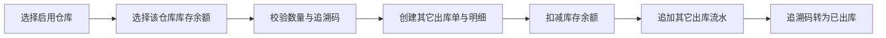

# 其它出库业务规则

其它出库用于领用、损耗等非销售场景。当前不记录客户、售价、金额或结构化出库原因，只记录单据与明细备注。

## 主流程

整张单据在一个事务中提交，任一明细失败时不保留单据、余额变化或流水。

## 业务规则

### ERP-OO-001 一张单据只对应一个仓库

其它出库必须选择启用且未删除的仓库。明细选择的库存余额必须属于该仓库；跨仓库出库需要分别创建单据。

### ERP-OO-002 明细直接选择库存余额

一张其它出库单包含 1 至 100 条明细。一条明细引用一个 `balanceId`，该标识同时确定仓库、产品品规和库存批次。表单不再分别选择产品品规和批次。

同一单据不能重复选择相同 `balanceId`，但不同余额即使产品和批号相同也可分别形成明细。

### ERP-OO-003 出库数量必须是可用包装单位数量

数量必须为正整数且不能超过提交时锁定余额的最新包装单位库存。库存不足时错误定位到具体明细，整单失败且不允许负库存。

### ERP-OO-004 追溯产品按码出库

必须追溯的产品需要提交与出库包装数量相等的追溯码；追溯码必须当前在库并属于所选余额。无需追溯的产品不能提交追溯码。

### ERP-OO-005 出库日期不能是未来日期

出库日期可以是当天或历史日期，不能晚于当前业务日期。

### ERP-OO-006 提交即完成且只读

其它出库没有草稿、审核、撤销、反审核、修改或删除。提交成功后只提供列表、详情和关联库存流水查看。

### ERP-OO-007 不计算销售金额

当前不保存销售单价或销售对象，不计算出库金额。详情中的批次成本用于库存追溯，不表示销售价格。

### ERP-OO-008 SKU 停用不阻止既有库存出库

只要库存余额存在、属于目标仓库且数量足够，产品品规后续停用不会阻止其历史库存被其它出库消耗。

## 页面交互

- 新建时先选仓库，再选择该仓库正库存余额。
- 已填写明细后切换仓库需要确认，确认后清空明细。
- 提交前前端批量查询最新余额进行提示；预检查不替代后端事务校验。
- 关闭已修改但未提交的表单时要求确认丢弃。
- 提交成功后关闭抽屉并刷新列表，不自动打开详情或流水。

## 查询与权限

- 列表支持出库单号、仓库、产品编码、批号和出库日期范围。
- 列表：`erp:otherOutbound:list`。
- 创建：`erp:otherOutbound:create`。
- 详情：`erp:otherOutbound:detail`。
- 整单库存流水：`erp:inventorySourceMovement:list`。

## 代码入口

- Model/DTO：`models/erp_other_outbound.go`。
- Service：`services/erp_other_outbound_service.go`。
- 库存扣减：`services/erp_inventory_service.go`。
- Controller：`controllers/erp_other_outbound_controller.go`。
- Router：`router/router.go` 中 `/api/erp/otherOutbounds`。
- 前端：`hive/apps/web-antdv-next/src/views/erp/otherOutbound`。
