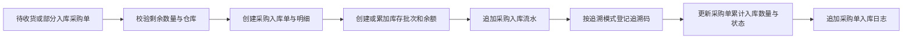

# 采购入库业务规则

采购入库单记录已确认采购单的实际收货结果。提交采购入库必须同时写入入库单、更新采购单累计入库数量、增加库存并追加采购单日志。

## 主流程

上述步骤处于同一数据库事务中，任一步失败均不保留部分结果。

## 业务规则

### ERP-PI-001 采购入库必须来源于一张采购单

只有 `WAITING_RECEIPT` 或 `PARTIAL_RECEIPT` 的采购单可以发起入库。一张采购入库单只对应一张采购单和采购单指定的一个仓库；不支持跨采购单或跨仓库合并入库。

### ERP-PI-002 入库明细必须引用采购明细

每条入库明细必须引用当前采购单的一条明细，产品品规和成本由该采购明细决定，前端不能传入另一个产品或修改成本。

### ERP-PI-003 入库不能超过剩余采购数量

同一次提交可把一条采购明细按批号、有效期拆成多行，但这些行的数量合计不能超过该采购明细剩余数量。

每张采购入库单包含 1 至 100 条明细。同一入库单中，采购明细、批号和有效期完全相同的行不能重复。

### ERP-PI-004 采购约定单价形成库存成本

入库明细成本固定继承采购明细约定单价，必须大于零且最多四位小数。产品价格资料后续变化不影响该成本。

### ERP-PI-005 入库日期不能是未来日期

入库日期表示实际业务日期，可以是当天或历史日期，但不能晚于当前业务日期。有效期当前只校验必填和日期格式，不判断是否早于入库日期。

### ERP-PI-006 已确认引用不受主数据停用影响

供应商或产品品规在采购单确认后停用，不阻止既有采购单继续入库；目标仓库必须在每次入库时仍处于启用状态。

### ERP-PI-007 提交即完成且只读

采购入库单没有草稿、审核、撤销、反审核、修改或删除状态。提交成功后只提供列表和详情查询。

### ERP-PI-008 追溯要求由产品品规决定

无需追溯的产品不能提交追溯码；必须追溯的产品每个包装单位必须提交一个唯一追溯码，追溯码数量决定该行入库数量。

### ERP-PI-009 金额为派生值

明细金额等于包装单位数量乘包装单位成本，单据合计金额为明细金额之和，使用四位小数展示，不单独维护入库单金额字段。

## 查询与权限

- 列表支持入库单号、采购单号、供应商、仓库、产品编码、批号和入库日期范围查询。
- 列表：`erp:purchaseInbound:list`。
- 创建：`erp:purchaseInbound:create`。
- 详情：`erp:purchaseInbound:detail`。
- 查看整单库存流水：`erp:inventorySourceMovement:list`。
- 创建入口当前放在采购单列表允许收货的状态操作中；采购入库列表不提供直接新增入口。

## 代码入口

- Model/DTO：`models/erp_purchase_inbound.go`。
- Service：`services/erp_purchase_inbound_service.go`。
- 库存写入：`services/erp_inventory_service.go`。
- Controller：`controllers/erp_purchase_inbound_controller.go`。
- Router：`router/router.go` 中 `/api/erp/purchaseInbounds`。
- 前端：`hive/apps/web-antdv-next/src/views/erp/purchaseInbound`。
