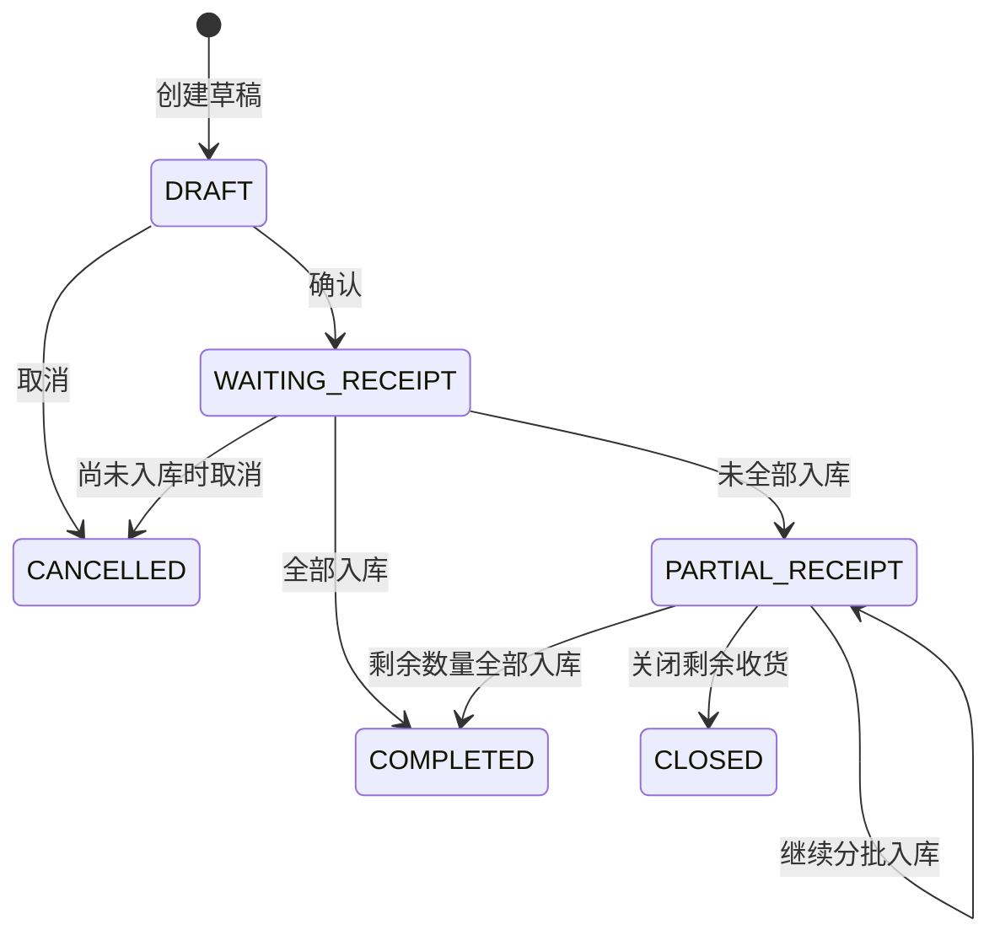

# 采购单业务规则

采购单记录供应商、目标仓库、采购日期、预计到货日期、采购明细和约定价格。采购单本身不改变库存。

## 状态流转

`COMPLETED`、`CANCELLED`、`CLOSED` 是终态，当前不支持恢复或反确认。

## 业务规则

### ERP-PO-001 创建后先形成完整草稿

创建采购单立即生成不可复用的采购单号并进入 `DRAFT`。草稿仍必须包含合法供应商、启用仓库、采购日期和至少一条合法采购明细。

### ERP-PO-002 草稿可整体编辑

只有 `DRAFT` 状态允许修改。修改使用 `expectedRowVersion` 校验并发，并按提交内容整体替换采购明细。

### ERP-PO-003 同一采购单的产品品规不能重复

一个产品品规在同一采购单中只能出现一条采购明细。每张采购单包含 1 至 100 条明细；每条订购数量必须为正整数，约定单价必须大于零且最多四位小数。

### ERP-PO-004 确认后冻结采购约定

确认执行 `DRAFT → WAITING_RECEIPT`，并记录确认人和确认时间。确认后供应商、仓库、日期、明细、数量、单价和备注均不可修改。

确认时重新检查供应商、仓库和产品品规是否仍可用于新业务，并保存供应商名称、产品编码、产品名称、规格和包装信息快照。

### ERP-PO-005 入库数量决定采购单状态

采购明细分别维护订购数量和累计入库数量。采购入库后，只要仍有未完成明细，采购单进入或保持 `PARTIAL_RECEIPT`；全部明细完成后进入 `COMPLETED`。

### ERP-PO-006 取消只适用于未发生入库的采购单

`DRAFT` 和尚未入库的 `WAITING_RECEIPT` 可以取消，必须填写去除首尾空白后非空且不超过 500 字符的原因。已部分入库的采购单不能取消。

### ERP-PO-007 关闭只适用于部分入库采购单

只有 `PARTIAL_RECEIPT` 可以关闭，必须填写原因。关闭保留已经完成的入库和库存结果，只终止剩余数量继续入库。

### ERP-PO-008 采购操作日志不可修改

创建、修改、确认、入库、取消和关闭都会追加采购单日志。日志记录动作、状态变化、摘要、操作人、时间，以及需要时的关联入库单或终止原因；失败操作不写日志。

### ERP-PO-009 采购单和日志按创建人受限

采购单列表、详情、草稿修改、确认、取消、关闭和操作日志均按采购单 `creator_id` 应用当前角色数据范围。操作日志继承采购单范围，不因日志操作人属于其它部门而单独放宽。创建采购单归属当前操作者，供应商、仓库和 SKU 仍是全局主数据。

## 典型场景

- 草稿确认后，供应商后来停用：既有采购单仍可继续入库。
- 草稿确认后，产品品规后来停用：既有采购明细仍可继续入库。
- 目标仓库后来停用：既有采购单暂停入库，仓库重新启用后才能继续。
- 已部分入库但供应商不再供货：关闭采购单，不撤销已入库库存。

## 页面动作与权限

| 状态 | 可用动作 | 权限 |
|---|---|---|
| `DRAFT` | 详情、修改、确认、取消 | `detail`、`update`、`confirm`、`cancel` |
| `WAITING_RECEIPT` | 详情、采购入库、取消 | `detail`、`erp:purchaseInbound:create`、`cancel` |
| `PARTIAL_RECEIPT` | 详情、继续入库、关闭 | `detail`、`erp:purchaseInbound:create`、`close` |
| 终态 | 详情 | `detail` |

采购单完整权限前缀为 `erp:purchaseOrder:`，日志另使用 `erp:purchaseOrder:logs`。

## 代码入口

- Model/DTO：`models/erp_purchase_order.go`。
- Service：`services/erp_purchase_order_service.go`。
- Controller：`controllers/erp_purchase_order_controller.go`。
- Router：`router/erp.go` 中 `/api/erp/purchaseOrders`。
- 前端：`hive/apps/web-antdv-next/src/views/erp/purchaseOrder`。
