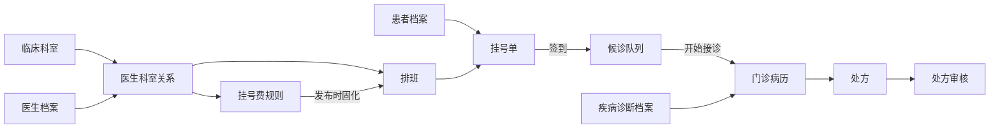

# 医疗业务手册

本目录记录 Hive 医疗域当前已实现业务规则，并保留尚未实现的药房统一词汇。进入医疗模块时先读本页和对应规则，再用代码核实现状。

## 阅读顺序

1. 先读 [医疗领域词汇](./CONTEXT.md)。
2. 按下表读取当前模块规则；跨模块动作同时阅读上下游文档。
3. 涉及页面时继续阅读前端 [医疗 UI 手册](../../../hive/business-docs/medical/README.md)。
4. 最后核对 Router、Controller、Service、Model、迁移和前端 API。

## 模块覆盖

| 模块 | 规则正文 | 主要后端入口 |
|---|---|---|
| 临床科室 | [department.md](./department.md) | medical_department_* |
| 医生管理 | [doctor.md](./doctor.md) | medical_doctor_* |
| 患者档案 | [patient.md](./patient.md) | medical_patient_* |
| 疾病诊断档案 | [diagnosis.md](./diagnosis.md) | medical_diagnosis_* |
| 挂号费 | [registration-fee.md](./registration-fee.md) | medical_registration_fee_* |
| 医生排班 | [schedule.md](./schedule.md) | medical_schedule_* |
| 挂号主流程 | [registration.md](./registration.md) | medical_registration_* |
| 挂号候诊队列 | [visit-queue.md](./visit-queue.md) | medical_visit_queue_* |
| 医生接诊、病历和处方审核 | [outpatient-workbench-draft.md](./outpatient-workbench-draft.md) | medical_outpatient_*、medical_prescription_* |

## 运行关系

## 规则编号

- MED-DEPT-*：临床科室。
- MED-DOC-*：医生档案和医生科室关系。
- MED-PAT-*：患者档案和隐私。
- MED-DIA-*：疾病诊断档案与病历诊断。
- MED-FEE-*：挂号费规则。
- MED-SCH-*：排班模板、实际排班和号源。
- MED-REG-*：挂号主流程。
- MED-QUE-*：签到和候诊队列。
- MED-WRK-*：医生工作台、叫号和接诊。
- MED-RX-*：处方、提交版本和审核。

已有编号不得分配给新的含义。

## 已规划但尚未实现

CONTEXT.md 中的门诊药房发药、药房路由、发药单、药房库存和药房申领单是统一术语和已确认边界；当前未发现对应 Router、Controller、Service、Model 或前端页面。开发前必须先形成模块规则正文，不得把术语说明误当作现有功能。

## 当前已知差异或限制

1. 删除医生当前不检查历史或未来排班引用，只软删除医生和医生科室关系。
2. 医生总预约开关不会级联修改医生科室关系；排班维度主要检查医生启用状态和关系预约开关。
3. 后端已有手工结束排班接口，前端排班日历当前没有暴露该动作。
4. 排班模板冲突检查包含停用模板，停用模板仍可能占用相同医生的星期、有效期和时间段。
5. 医生接诊文档文件名保留 draft 历史名称，但正文状态为首期已实现；后续可在独立清理任务中重命名并同步全部链接。
