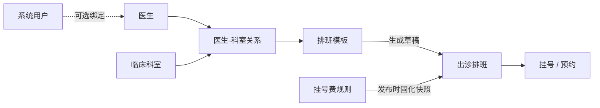

# 医疗业务手册

本目录记录 Hive 医疗域的当前业务规则。本轮先覆盖医生管理和医生排班；患者、挂号、挂号费等历史内容仍在根目录 `CONTEXT.md`，后续按模块逐步迁移。

## 阅读顺序

1. 先读 [医疗领域词汇](./CONTEXT.md)。
2. 医生档案任务读 [医生管理规则](./doctor.md)。
3. 出诊任务读 [医生排班规则](./schedule.md)，并同时核对医生、科室和挂号费规则。
4. 涉及页面时继续阅读前端 `hive/business-docs/medical`。
5. 文档与代码不一致时列出差异和影响，不静默选择。

## 模块关系

| 模块 | 职责 | 文档 |
|---|---|---|
| 医生管理 | 医生档案、用户绑定、出诊科室和启停 | [doctor.md](./doctor.md) |
| 医生排班 | 周期模板、实际排班、号源、发布和自动任务 | [schedule.md](./schedule.md) |

## 规则编号

- `MED-DOC-*`：医生档案和医生科室关系。
- `MED-SCH-*`：排班模板、实际排班、号源和自动任务。

已有编号不得分配给新的含义。

## 当前待确认项

1. 删除医生当前不检查历史或未来排班引用，只软删除医生和医生科室关系；长期数据治理方案待确认。
2. 医生总开关 `appointmentEnabled` 当前不会级联修改医生科室关系，排班维度校验也只直接检查医生启用状态和科室关系的预约开关。
3. 后端已有手工“结束排班”接口，当前前端 API 和排班日历没有暴露该动作。
4. 排班模板冲突检查会考虑所有未删除模板，包括停用模板；停用模板仍会占用相同医生的星期、有效期和时间段。

## 代码入口

- Router：`router/router.go` 中 `/api/medical`。
- 医生：`models/medical.go`、`services/medical_doctor_service.go`。
- 排班：`models/medical_schedule*.go`、`services/medical_schedule*.go`。
- 前端页面：`hive/apps/web-antdv-next/src/views/medical/doctor`、`medical/schedule`。
- 前端 API：`hive/apps/web-antdv-next/src/api/medical`。

