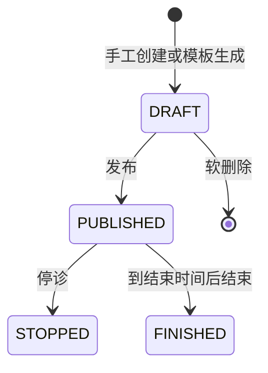

# 医生排班业务规则

排班分为周期模板和具体日期的实际排班。模板本身不进入预约链路，必须先生成草稿排班，再发布。

## 状态流转

状态值为 `0=DRAFT`、`1=PUBLISHED`、`2=STOPPED`、`3=FINISHED`。停诊和结束当前没有恢复动作。

## 模板规则

### MED-SCH-001 模板必须落在有效出诊维度

模板必须指定启用医生、启用临床科室、启用且开放预约的医生科室关系，以及启用的挂号类型字典值。星期使用 ISO 规则 `1=周一` 至 `7=周日`。

### MED-SCH-002 模板时间按半小时切分号源

开始和结束时间必须为整点或半点，结束晚于开始且整段至少 30 分钟。每半小时默认容量为 1 至 99，单档覆盖容量为 0 至 99；覆盖时间必须位于整段范围且不能重复。整段总容量必须大于零。

### MED-SCH-003 同一医生的周期模板不能重叠

只要星期有交集、有效期有交集且时间段有交集，就视为冲突。当前冲突检查包含所有未删除模板，不区分模板启用或停用状态。

### MED-SCH-004 删除模板不删除已生成排班

模板启停只影响后续自动或手工生成；删除模板是软删除。已经生成的实际排班保留模板和生成批次来源，不随模板变化自动更新或删除。

## 实际排班规则

### MED-SCH-005 新排班只能是今天或未来的草稿

手工创建和模板生成都产生草稿。出诊日期不能早于今天；同一医生、同一天的草稿或已发布排班时间段不能重叠，已停诊和已结束记录不阻止新排班。

### MED-SCH-006 只有草稿可以编辑或删除

编辑草稿时重新校验医生、科室、挂号类型、关系有效期和时间冲突，并整体重建半小时号源档位。删除支持每次 1 至 100 个排班，并软删除排班和号源档位；任一记录不是草稿时整次操作失败。

### MED-SCH-007 发布时重新验证并固化费用

发布支持每次 1 至 100 个草稿，并在一个事务中完成。发布要求排班尚未开始、医生和出诊维度仍有效、号源存在且容量不小于已预约量、总容量大于零，并且出诊日期恰好匹配一条挂号费规则。

成功发布后状态变为 `PUBLISHED`，记录发布时间，并把挂号费规则 ID、版本和金额固化为快照。之后挂号费规则变化不回写既有排班快照。

### MED-SCH-008 停诊必须提供原因

只有已发布排班可以停诊。原因去除首尾空白后不能为空且最多 512 个字符；成功后进入 `STOPPED` 并记录原因和时间。

### MED-SCH-009 结束只能发生在出诊结束后

只有已发布排班可以结束，并且当前业务时区下必须已经到达排班结束时间。成功后进入 `FINISHED` 并记录结束时间。

## 生成与自动任务

### MED-SCH-010 手工生成受日期和幂等约束

一次生成可选择 1 至 100 个模板，日期范围从今天起且最远覆盖未来 90 天。请求必须提供最多 64 字符的幂等键：相同键和相同参数重复请求返回原结果，相同键配不同参数会冲突。

模板对应日期若已有由同一模板生成且维度一致的排班则跳过；若与其它草稿或已发布排班冲突，则生成失败，不留下部分结果。

### MED-SCH-011 每周自动任务按医生隔离结果

系统每周日 20:00（业务时区）执行：

1. 发布下一周全部草稿排班；
2. 按启用模板生成下下周草稿排班。

自动发布和生成均按医生分组执行，一个医生失败不会阻止其他医生；任务记录成功医生数、失败医生及原因，状态为成功、部分成功、失败或处理中。服务重启会把遗留的处理中任务标记为失败。

## 候诊队列

### MED-SCH-012 排班汇总并查询候诊队列

排班列表为每条实际排班返回 `queueCount`，表示该排班下全部候诊记录总数，不按候诊状态过滤。草稿排班不展示候诊入口；已发布、已停诊和已结束排班可以通过只读抽屉查看候诊队列。

候诊列表不分页，按签到序号升序返回。患者姓名和手机号始终由服务端脱敏，不受患者敏感信息查看权限影响。候诊状态推进规则见 `visit-queue.md`。

### MED-SCH-013 排班详情返回当前完整快照

排班详情通过 `GET /medical/schedules/{scheduleId}` 查询，返回医生、科室、出诊日期和时段、挂号类型、状态、费用快照、号源汇总、候诊总人数、状态时间、备注及半小时号源档位。详情查询只读，不触发排班状态或号源变化。

### MED-SCH-014 实际排班按创建人受限

实际排班列表、详情、编辑、删除、发布、停诊、结束和候诊队列入口均按排班 `creator_id` 应用当前角色数据范围。手工创建或生成的排班归属当前操作者；候诊队列继承父排班范围。周期模板和自动任务记录仍是全局排班配置，不按创建人过滤。

### MED-SCH-015 自动排班继承模板归属

后台每周自动生成没有登录操作者，因此新排班和号源继承各自周期模板的创建人。历史自动排班中可以从生成批次和模板可靠推断的空归属，由 `20260813_03_data_permission_owner_backfill_up.sql` 回填；无法推断的空归属记录只对全部数据范围用户可见。

生成幂等键还绑定发起用户：手工用户不能复用另一个用户或自动任务占用的键，自动任务也不能复用手工键。相同用户、相同键和相同参数才返回原结果。

## 权限

- 模板：`medical:scheduleTemplate:list`、`create`、`update`、`status`、`delete`。
- 排班：`medical:schedule:list`、`detail`、`create`、`update`、`delete`、`generate`、`publish`、`stop`、`finish`。
- 候诊队列：`medical:visitQueue:list`。
- 自动任务：`medical:scheduleTask:list`。

## 代码入口

- Model/DTO：`models/medical_schedule.go`、`models/medical_schedule_extension.go`。
- Service：`services/medical_schedule_service.go`、`medical_schedule_validation.go`、`medical_schedule_generation.go`、`medical_schedule_auto.go`。
- Controller：`controllers/medical_schedule_controller.go`。
- Router：`router/medical.go` 中 `/api/medical/scheduleTemplates`、`schedules`、`scheduleTasks`。
- 前端：`hive/apps/web-antdv-next/src/views/medical/schedule`。
