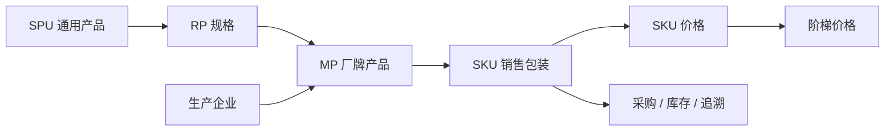

# 产品档案业务手册

本手册记录 Hive 当前产品档案的层级、维护规则、价格规则和代码入口，供产品、开发、测试和 AI 共同使用。内容描述当前代码已经实现的行为，不代替未来产品规划。

## 阅读顺序

1. 先读 [产品领域词汇](./CONTEXT.md)。
2. 再读 [产品档案规则](./product-archive.md) 和 [SKU 价格规则](./sku-price.md)。
3. 涉及页面时继续阅读前端 `hive/business-docs/product`。
4. 涉及 ERP 时同时阅读 `business-docs/erp`，因为 ERP 直接引用 SKU、包装换算和追溯模式。
5. 文档与代码不一致时列出差异和影响，不静默选择。

## 结构

| 模块 | 职责 | 文档 |
|---|---|---|
| 产品档案 | 维护 SPU、RP、MP、SKU 层级和启停状态 | [product-archive.md](./product-archive.md) |
| SKU 价格 | 维护价格范围、生效期和阶梯价格 | [sku-price.md](./sku-price.md) |

## 规则编号

- `PROD-ARC-*`：产品档案层级及主数据规则。
- `PROD-PRICE-*`：SKU 价格及阶梯价格规则。

已有编号不得分配给新的含义；修改规则语义时保留编号并同步说明。

## 当前待确认项

1. SPU、RP、MP、SKU 当前只有启停，没有删除接口；是否需要归档能力尚未形成规则。
2. 上级停用不会级联修改下级状态，但业务下拉通常要求整条层级均启用；页面展示状态与“可被新业务选择”不是同一概念。
3. 非全局价格的 `scopeId` 当前页面复用企业主体选项；`CUSTOMER`、`CHANNEL` 与企业主体的长期边界仍需产品确认。
4. 根目录 `CONTEXT.md` 仍有产品档案的历史长篇说明。本目录是产品新任务的阅读入口，暂不移动或删除历史内容。

## 代码入口

- Router：`router/router.go` 中 `/api/product`。
- Model/DTO：`models/product_*.go`。
- Service：`services/product_*_service.go`。
- Controller：`controllers/product_*_controller.go`。
- 前端页面：`hive/apps/web-antdv-next/src/views/product/spu`。
- 前端 API：`hive/apps/web-antdv-next/src/api/product`。

