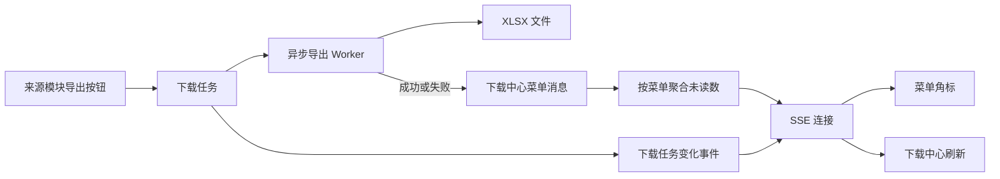

# 系统消息与下载中心业务手册

本手册记录 Hive 当前菜单消息推送和异步下载中心的业务边界、状态、运行链路与代码入口。这里的“消息推送”特指菜单未读角标和系统内部实时事件，不等同于完整站内信、右上角通知中心、短信、邮件或移动端推送。

## 阅读顺序

1. 先读 [系统消息与下载领域词汇](./CONTEXT.md)。
2. 消息任务读 [菜单消息推送规则](./message-push.md)。
3. 异步导出任务读 [下载中心规则](./download-center.md)。
4. 涉及页面时继续阅读前端 `hive/business-docs/system`。
5. 涉及具体导出来源时，还要阅读来源模块规则和对应导出器。

## 运行关系

| 模块 | 职责 | 文档 |
|---|---|---|
| 菜单消息推送 | 持久化菜单未读消息、聚合角标并通过 SSE 推送 | [message-push.md](./message-push.md) |
| 下载中心 | 管理异步导出任务、进度、文件下载和保留期 | [download-center.md](./download-center.md) |

## 规则编号

- `SYS-MSG-*`：菜单消息、未读汇总与实时事件。
- `SYS-DL-*`：下载任务、导出文件、Worker 与清理规则。

已有编号不得分配给新的含义。

## 当前待确认项

1. SSE 订阅中心位于单个后端进程内，多实例部署时不能跨实例广播；消息未读数可以靠重新查询校准，但下载进度事件可能延迟到用户手工刷新。
2. 下载文件保存在后端实例本地目录，多实例、容器重建和共享存储方案尚未形成正式架构决策。
3. 菜单消息没有逐条查询、逐条已读、删除或定期清理能力；标题和内容当前只入库，页面只消费按菜单聚合的未读数量。
4. 前端右上角通知组件仍使用框架演示数据，没有接入菜单消息。
5. 下载任务当前没有取消、重试或人工删除动作。

## 代码入口

- 菜单消息：`models/menu_message.go`、`services/menu_message_service.go`、`controllers/system_menu_message_controller.go`。
- 下载中心：`models/download_task.go`、`services/download_task_service.go`、`controllers/system_download_controller.go`。
- 导出器：`services/*_download_exporter.go`。
- Router：`router/router.go` 中 `/api/system/messages`、`/api/system/downloads` 及各来源模块的导出接口。
- 前端：`hive/apps/web-antdv-next/src/store/menu-message.ts`、`src/views/system/message`、`src/views/system/downloadCenter`。

