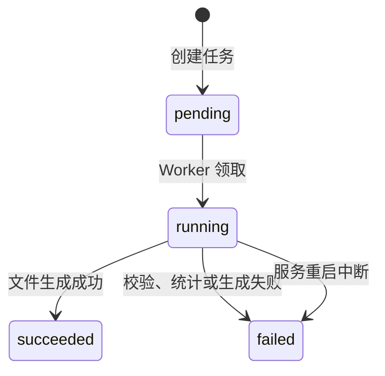

# 下载中心业务规则

下载中心承接来源模块创建的异步 XLSX 导出任务。来源模块决定导出条件和权限，下载中心负责排队、生成、进度、文件保留和本人下载。

## 状态流转

`succeeded` 和 `failed` 是终态，当前没有取消、重试或恢复到等待状态的动作。

## 业务规则

### SYS-DL-001 来源模块负责创建权限和导出条件

用户从来源页面按当前筛选和排序创建任务。下载中心不改变来源模块的数据范围语义，但 Worker 在计数和生成时会按任务创建用户重新解析当时有效的数据权限，不能沿用创建时的长期权限快照。当前正式接入的任务类型为：

- `inventoryBalance`：库存余额导出，创建权限 `erp:inventoryBalance:export`。
- `devTask`：开发任务导出，创建权限 `dev:task:export`。
- `loginLog`：登录日志导出，创建权限 `system:loginLog:export`。

增加任务类型时必须同时注册任务类型、导出器、来源接口、前端请求类型、权限和文档。

### SYS-DL-002 每个用户最多三个活动任务

同一创建者处于 `pending` 或 `running` 的任务合计达到 3 个时，新的导出请求返回冲突。成功或失败任务不占用活动名额。

当前创建锁只在单个后端进程内生效，多实例同时创建时存在突破上限的竞态，不能把“最多三个”视为数据库级强约束。

### SYS-DL-003 Worker 按创建时间领取等待任务

Worker 收到唤醒信号或每 5 秒轮询一次，按创建时间从早到晚领取 `pending` 任务。领取使用条件更新，只有仍为等待状态的任务才能进入 `running`。

单个进程内串行生成；多实例可能分别领取不同任务并行生成。

### SYS-DL-004 导出前统计并限制最大行数

导出器先按保存的请求条件统计总行数。最大行数读取系统参数 `DOWNLOAD_MAX_EXPORT_ROWS`，默认 200000，参数取值限制为 1 至 1000000。超过上限直接失败，不生成可下载文件。

导出过程中如果数据变化导致分页结果与预期不一致，任务以“导出数据在生成期间发生变化，请重新发起导出”失败，不交付可能不完整的文件。

### SYS-DL-005 进度只在成功时达到 100

任务创建时进度为 0。生成过程中每累计约 500 行或到达末尾更新一次，运行态进度最高为 99；只有文件保存并读取元数据成功后才进入 `succeeded`、写入处理行数并设为 100。

### SYS-DL-006 成功和失败都会通知创建者

等待、运行、进度、成功和失败变化都会发送瞬时 `downloadTaskChanged` 事件。成功或失败还会在下载中心菜单下创建持久化菜单消息；瞬时事件失败或消息创建失败不回滚任务结果。

### SYS-DL-007 只有创建者可以查询和下载

任务列表始终按当前登录用户的创建者 ID 过滤，支持任务名称、状态和创建时间范围筛选。文件下载同时校验任务 ID 和创建者 ID，不能下载其他用户的文件。

列表和文件接口当前只要求登录，没有额外按钮权限；创建任务仍受来源模块导出权限控制。

### SYS-DL-008 文件仅在成功且未过期时可下载

文件必须属于 `succeeded` 任务，具备文件名、文件路径和未来的过期时间，并且服务器文件实际存在。任一条件不满足都返回“文件尚未生成或已过期”。当前文件格式统一为 XLSX。

### SYS-DL-009 文件和任务记录分阶段清理

成功文件保留 7 天。清理器在服务启动时运行一次，之后每 24 小时运行：到期文件被删除并清空私有文件路径；创建超过 30 天且已经没有文件路径的任务记录被物理删除。

失败任务没有文件，满足 30 天条件后会被清理；成功任务通常先在文件到期后进入无文件状态，再等待记录清理条件。

### SYS-DL-010 服务重启终止运行中任务

启动 Worker 时，所有遗留 `running` 任务统一标记为失败，失败原因为“服务重启，任务已终止”，并生成终态菜单消息。遗留 `pending` 任务保持等待并重新进入处理队列。

当前恢复逻辑不区分任务属于哪个实例；多实例环境中任一实例启动，都可能把其它仍在工作的实例所处理的运行中任务标记为失败。

### SYS-DL-011 文件存储当前依赖本地实例

导出文件保存在运行目录下的 `data/downloads`，任务记录保存私有路径且接口不向前端返回。当前没有对象存储或共享文件系统抽象；容器重建、实例切换或本地文件丢失都会使成功记录变为不可下载。

### SYS-DL-012 执行时重新解析来源数据范围

Worker 以下载任务记录不可由请求负载覆盖的 `creator_id` 作为权限主体。库存余额和开发任务导出器在统计与写文件前重新加载该用户当前的有效状态、角色和部门，并在来源查询上应用与页面列表相同的范围。用户被停用、删除或授权解析失败时任务失败；权限收紧时只生成收紧后仍可见的数据，权限扩大时可能包含执行时新增的可见数据。

导出器同时兼容历史任务直接保存筛选条件的裸 JSON，以及当前 `{ "request": ... }` 封装格式；旧封装中即使存在 `userId` 也会被忽略，权限主体只取任务表的创建者。因此升级后遗留 `pending` 任务可以继续安全执行。

### SYS-DL-013 预览链接使用短时签名 token

下载中心只生成 XLSX 文件，浏览器无法原生预览，前端通过 kkFileView 等外部预览服务渲染。外部预览服务没有登录态，无法直接调用 `GET /api/system/downloads/:id/file`，因此由 `GET /api/system/downloads/:id/preview-url` 生成短时签名 URL 供外部服务无鉴权取文件。

- 生成链接接口要求登录，复用 `SYS-DL-007` 和 `SYS-DL-008` 的全部校验：任务属于当前登录用户、状态为 `succeeded`、文件名和文件路径存在且未过期、服务器文件实际存在。
- 链接生成时签发 5 分钟有效的 HS256 JWT token，payload 中携带 `taskId` 和 `userId`，密钥复用项目 `config.AppConfig.JWT.Secret`，token 不写入数据库。
- 公开取文件接口 `GET /api/public/downloads/preview/:token` 不经过认证中间件；先通过 JWT 签名校验确认 token 由本服务签发且未过期，再复用 `SYS-DL-007` 和 `SYS-DL-008` 校验确保 token 有效期内任务仍属于签发用户且文件仍可下载。任一校验失败返回对应错误，不返回文件流。
- 预览链接返回相对路径，由前端用 `window.location.origin` 拼接为完整 URL（dev 走 vite proxy 到后端，生产走 nginx 反代），URL 上附加 `?fullfilename=<encodeURIComponent(fileName)>` 让 kkFileView 识别文件类型（公开接口路径不含扩展名，必须显式传文件名），Base64 编码后透传给 kkFileView `/onlinePreview?url=<base64(absoluteUrl)>` 在新窗口打开。前端不向外部预览服务透露用户 Token。
- kkFileView 服务端必须配置 `trust.host` 白名单加入前端访问域名（dev 为 `localhost,127.0.0.1`，生产为前端域名），否则被 SSRF 防护拦截，返回 403。
- token 在有效期内可重放使用，不强制一次性；预览完成后由前端关闭窗口即可，无需后端清理。需要更严格的失效控制时再引入数据库存储的一次性 token，当前以短时有效期作为主要防护。

### SYS-DL-014 VXE 导出配置由来源导出器解释

开发任务导出接口兼容 VXE Table 的远端导出配置：`filename` 控制下载文件名，`sheetName` 控制工作表名称，`columns` 控制列顺序、表头标题和近似列宽，`isHeader` 控制是否写入表头，`isTitle` 控制表头取列标题还是字段名，`original` 控制字典值是否保留数据库原值。

后端只接受开发任务导出器登记的列白名单，未知列会被忽略；`columns` 为必填项，接口在创建任务前拒绝缺少导出列的请求，不再回退历史固定列。`operation` 等操作列不属于导出白名单。文件名和工作表名称由后端清理非法字符并限制长度，不能通过请求写入服务器路径。

库存余额导出同样接受上述 VXE 配置，但 `columns` 为必填项；接口在创建任务前拒绝缺少导出列的请求，不再回退为全部固定列。库存余额的 `filename` 和 `sheetName` 可以为空，分别回退为下载中心默认文件名和“库存余额”工作表名。

## 接口与权限

| 接口 | 用途 | 权限边界 |
|---|---|---|
| `GET /api/system/downloads` | 当前用户任务列表 | 登录即可，只返回本人 |
| `GET /api/system/downloads/:id/file` | 下载成功文件 | 登录即可，只允许创建者 |
| `GET /api/system/downloads/:id/preview-url` | 生成 5 分钟有效的预览链接 | 登录即可，只允许创建者 |
| `GET /api/public/downloads/preview/:token` | 公开取预览文件流 | 公开接口，通过 JWT 签名校验确保 token 由本服务签发且未过期，再复用创建者和文件可用性校验 |
| `POST /api/erp/inventory/balances/exports` | 创建库存余额导出 | `erp:inventoryBalance:export` |
| `POST /api/dev/tasks/exports` | 创建开发任务导出 | `dev:task:export` |
| `POST /api/system/loginLogs/exports` | 创建登录日志导出 | `system:loginLog:export` |

## 代码入口

- Model/DTO：`models/download_task.go`。
- Service 与 Worker：`services/download_task_service.go`。
- XLSX 公共写入：`services/download_workbook.go`。
- 导出器：`services/erp_inventory_download_exporter.go`、`services/dev_task_download_exporter.go`、`services/login_log_download_exporter.go`。
- Controller：`controllers/system_download_controller.go` 及来源模块 Controller。
- 前端：`hive/apps/web-antdv-next/src/views/system/downloadCenter`。
